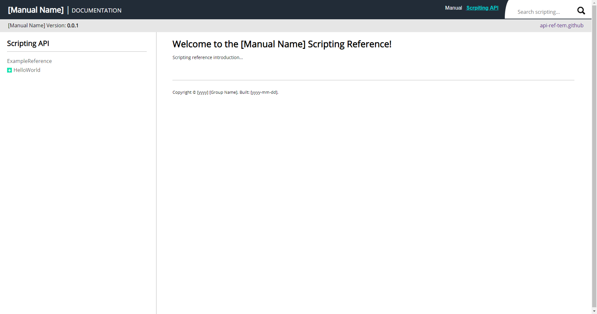

# API Reference Template #

The goal of this project is for API developer who do not actually 
care too much about the looks of their API documents. This project 
provide a simple API reference website template, so once the developer 
have done developed their API. They can use this website(template) to 
fast create their API document webpage. <br/><br/>


## Acknowledge ##
This application is using NodeJS for the backend. You might need 
some knowledge of `express.js` in order to expand the application 
if you need to. The frontend are only using the basic `HTML`, `CSS`, 
and `jQuery`. You will also need the minimal knowledge of these tools.


## How to use? ##
All the api components will be search under `./website/ScriptReference/api` 
directory. The manual components will be search under `./website/Manual/doc` 
directory. Make all the API references into a HTML files then the server 
should acknowledge the changes and display it in the webpage. Importantly 
that the path cannot contain any space character. Please use underscore 
instead of just remove all the spaces completely.

### Directory ###
* Bad : `./website/ScriptReference/api/Hello World`
* Good : `./website/ScriptReference/api/Hello_World`
* Good : `./website/ScriptReference/api/HelloWorld`

### File ###
* Bad : `./website/ScriptReference/api/Hello World.html`
* Good : `./website/ScriptReference/api/Hello_World.html`
* Good : `./website/ScriptReference/api/HelloWorld.html`


## Run the application ##
Before you run the application, make sure you install node.js to 
your OS environment. Step one, run `./scripts/setup.bat`, this 
file will install all the dependencies you need for this project. 
Step two, run `./scripts/run.bat` in order to start the server. 
If you are running of Linux environment just execute the same scripts 
but with `.sh` extension behind. Step three, run you favorite web 
browser with `localhost:3000` and the following screen should appear 
infront of you. 

Manual Screen                                                   | Scripting Reference Screen
:--------------------------------------------------------------:|:----------------------------------------------------------------------------:|
  |  


## Code Section CSS Support ##
The client will automatically convert spaces to HTML seeable spaces (&nbsp). 
And convert `\n` to `<br/>`. Here is the example code if you wish 
to apply these feature in you document content page. Use the `code-block` 
class to implement a code text area. Use `code-inline` for inline code. 

```
Code: <div class="code-inline">Inline code</div>

<div class="code-block">
    /**
     * Code comment.
     * @param args : Parameters array.
     */
    Code block
  
</div>
```
This file in under `./website/ScriptReference/api/ExampleReference.html`


## Example ##
* JCSUnity-Scrpting-Manual : https://github.com/jcs090218/JCSUnity-Scripting-Manual
