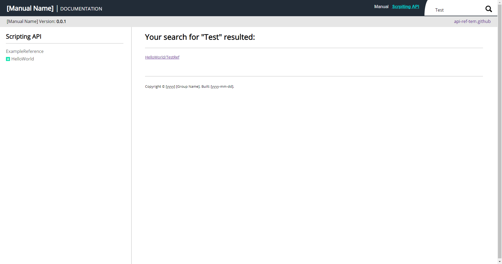

[](https://travis-ci.com/jcs090218/API-Reference-Template)
[](https://opensource.org/licenses/MIT)


# API Reference Template #

* Demo: <a href="http://www.jcs-profile.com:3000">API_Reference_Template</a>

The goal of this project is for API developer who do not actually
care too much about the looks of their API documents. This project
provide a simple API reference website template, so once the developer
have done developed their API. They can use this website(template) to
fast create their API document webpage. <br/><br/>


## Acknowledge ##
This application is using NodeJS for the backend. You might need
some knowledge of `express.js` in order to expand the application
if you need to. The frontend are only using the basic `HTML`, `CSS`,
and `jQuery`. You will also need the minimal knowledge of these tools.


## How to use? ##
All the api components will be search under `./website/ScriptReference/api`
directory. The manual components will be search under `./website/Manual/doc`
directory. Make all the API references into a HTML files then the server
should acknowledge the changes and display it in the webpage. 


## Run the application ##
Before you run the application, make sure you install node.js to
your OS environment. Step one, run `./scripts/setup.bat`, this
file will install all the dependencies you need for this project.
Step two, run `./scripts/run.bat` in order to start the server.
If you are running of Linux environment with bash installed, just
execute the same scripts but with `.sh` extension behind.
Step three, run you favorite web browser with `localhost:3000` and
the following screens should appear infront of you.

Manual Screen                                                   | Scripting Reference Screen
:--------------------------------------------------------------:|:----------------------------------------------------------------------------:|
  |  


## Deploy on to server ##
If you are ready to deploy your scripting manual application, run
`./scripts/start_forever.bat` and the server will run even you terminated
the console. If you want to stop the server, run `./scripts/stop_forever.bat`
to terminate the previous started server. If you are on linux distro
with bash installed, run the same script but with `.sh` extension behind.


## Code block display on website ##
The client will automatically convert these HTML string to entity 
string. So you do not have to do all the translation yourself in 
the code block.

### Code Conversion List ###
|           HTML |      Entity | Displayed |
|---------------:|------------:|-----------|
|                | &amp;nbsp;  |           |
| \n • \r • \r\n | &lt;br/&gt; |           |
|            -<- |    &amp;lt; | <         |
|            ->- |    &amp;gt; | >         |

Here is the example code if you wish to apply these feature in you 
document content page. Use the `code-block` class to implement a 
code text area. Use `code-inline` for inline code.

```
Code: <div class="code-inline">Inline code</div>

<div class="code-block">
    /**
     * Code comment.
     * @param args : Parameters array.
     */
    Code block

</div>
```
This file in under `./website/ScriptReference/api/ExampleReference.html`


## Directing to other page ##
### Path Keyword Conversion List ###
| Key  | Entity |
|------|--------|
| _sl_ | /      |
| _sp_ |        |

If you wish to direct to other page, see the code below for example. This 
line of code will direct user to `./api/HelloWorld/Test Ref.html` page.
```
<!-- Here _sl_ will convert to slash. And _sp_ will convert to space. -->
<a href="?page=HelloWorld_sl_Test_sp_Ref">Test Ref</a>
```

## Search Engine ##
Search engine is implemented by simply comparing the file name with keyword 
case insensitively.



## Configuration ##
If you do not like any of these settings, checkout `./config.js` and `./website/js/config.js`.
You can change the path, manual name, version number, copyright text, etc.
Basically anything you need to make a API reference document website.

If you do not like style you can load you own CSS file at `./website/css-lib.html`.
Or change the CSS property in `./website/css/style.css`. For the content's style can
be found in `./website/css/content.css`.


## Example ##
* JCSUnity-Scrpting-Manual : https://github.com/jcs090218/JCSUnity-Scripting-Manual
